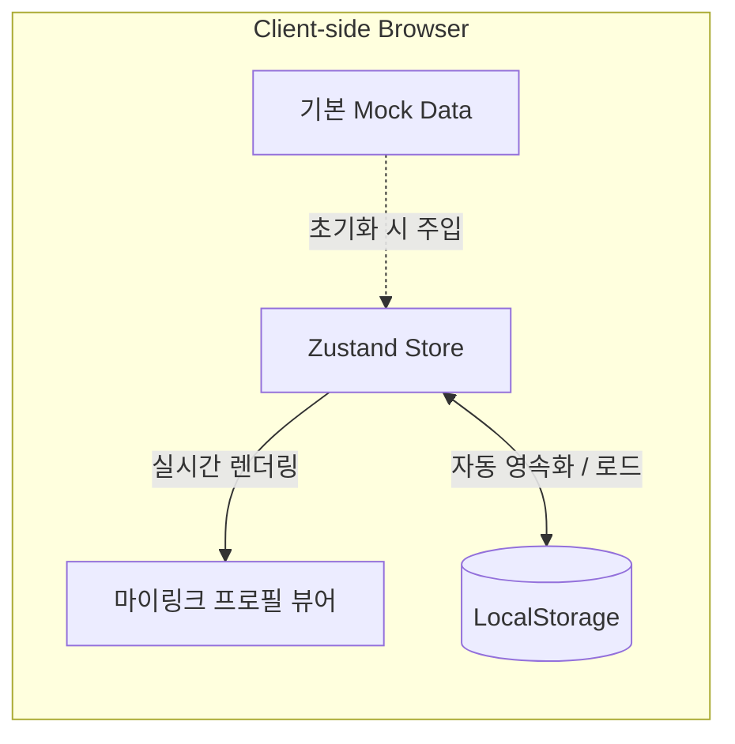

# [PRD] 링크트리 클론 서비스: 마이링크 (MyLink)

---

## 1. 프로젝트 개요 (Overview)

- **서비스명**: 마이링크 (MyLink)
- **한 줄 정의**: 크리에이터와 1인 브랜드를 위한 실시간 반응형 다중 링크 프로필 서비스
- **구동 환경**: 클라이언트 전용 데모 (LocalStorage 및 Mock Data 기반 독립 구동 SPA)
- **핵심 기술 스택**:
  - **프레임워크/UI**: React / Next.js, Tailwind CSS, Lucide React (아이콘)
  - **전역 상태 관리**: **Zustand** (`persist` 미들웨어를 통한 `localStorage` 자동 영속화)
- **단계별 개발 전략**:
  - 🎯 **Phase 1 (현재 목표 - 시연용 MVP)**: **LocalStorage 기반 프로필 페이지 및 기본 링크/블록 렌더링 & 편집**
  - ⏳ **Phase 2 (차기 개발)**: 대시보드 및 통계/애널리틱스 (조회수, 클릭 트래킹, CTR 집계)
  - ⏳ **Phase 3 (확장)**: 드래그 앤 드롭 순서 변경 고도화, 미디어 임베드

---

## 2. 타깃 고객 및 핵심 시나리오 (Target & User Scenario)

### 2.1 타깃 고객 (Primary Target)
- **SNS 크리에이터 / 인플루언서 / 1인 창작자**
  - 여러 채널(인스타그램, 유튜브, 블로그, 포트폴리오 등)을 하나의 모바일 최적화 링크 페이지로 묶어 제공하고자 하는 사용자

### 2.2 사용자 시나리오 (User Scenarios)

#### 👤 1. 방문자 관점 (Visitor Scenario)
1. **페이지 진입**: **사용자는** 크리에이터의 다양한 활동 채널과 콘텐츠를 한곳에서 확인하기 위해 **SNS 프로필에 등록된 마이링크 URL을 클릭한다.**
2. **프로필 탐색**: **사용자는** 해당 크리에이터가 누구인지 정체성과 최근 소식을 파악하기 위해 **상단의 프로필 아바타 이미지, 닉네임, Bio(소개글)를 확인한다.**
3. **소셜 미디어 바로가기**: **사용자는** 크리에이터의 다른 공식 SNS 채널(유튜브, 인스타그램, 깃허브 등)로 바로 이동하기 위해 **프로필 하단에 배치된 소셜 아이콘을 클릭한다.**
4. **콘텐츠/섹션 탐색**: **사용자는** 자신이 찾고자 하는 링크가 어떤 카테고리에 속해 있는지 구분하기 위해 **섹션 헤더 및 안내 텍스트 블록을 읽는다.**
5. **목적 링크 클릭 및 외부 이동**: **사용자는** 관심 있는 최신 영상, 포트폴리오, 공구 페이지 등으로 이동하기 위해 **원하는 웹 링크 버튼을 클릭하여 새 탭으로 외부 사이트에 접속한다.**

#### 👑 2. 소유자 관점 (Owner / Creator Scenario)
1. **관리 모드 진입**: **사용자는** 자신의 프로필 정보와 링크 목록을 편집하기 위해 **마이링크 관리자/에디터 화면에 접속한다.**
2. **새로운 링크 블록 추가**: **사용자는** 홍보하고 싶은 새로운 웹사이트나 콘텐츠를 프로필에 노출하기 위해 **'링크 추가' 버튼을 누르고 링크 제목과 URL, 아이콘을 입력한다.**
3. **기존 링크 정보 수정**: **사용자는** 오타를 바로잡거나 변경된 최신 주소로 업데이트하기 위해 **수정하려는 링크 블록을 클릭하여 제목이나 URL을 변경한다.**
4. **링크 임시 숨김 (On/Off 토글)**: **사용자는** 링크를 영구 삭제하지 않고 일시적으로 방문자에게 보이지 않게 처리하기 위해 **해당 링크 블록의 활성화(Enable) 토글 스위치를 끈다.**
5. **섹션 헤더/구분선 추가**: **사용자는** 링크가 많아졌을 때 방문자가 쉽게 읽을 수 있도록 그룹별로 나누기 위해 **'헤더 블록' 또는 '구분선(Divider)'을 추가하여 섹션을 분리한다.**
6. **불필요한 링크 삭제**: **사용자는** 기간이 만료되었거나 더 이상 필요 없는 링크를 정리하기 위해 **해당 블록의 삭제(휴지통) 버튼을 눌러 목록에서 제거한다.**
7. **실시간 변경사항 검증 및 자동 저장**: **사용자는** 방문자에게 보여질 실제 모바일 화면의 시각적 완성도를 확인하기 위해 **화면의 프로필 미리보기를 확인하며 LocalStorage에 변경 데이터가 자동으로 영속화되는 것을 확인한다.**

---

## 3. 시스템 아키텍처 & 데이터 흐름 (Phase 1)



- **저장소**: 브라우저 `localStorage` (Key: `mylink-storage`)
- **초기 상태**: 서비스 접속 시 기본 크리에이터 Mock 프로필이 자동 로드됨.
- **초기화 지원**: 언제든 기본 Mock 데이터로 되돌릴 수 있는 '기본값 복원' 액션 제공.

---

## 4. Phase 1 상세 기능 요구사항 (Functional Requirements)

### 4.1 프로필 헤더 영역 (Profile Header)

| 기능 ID | 기능명 | 상세 사양 | 우선순위 |
| :--- | :--- | :--- | :--- |
| **PRF-01** | 프로필 아바타 | 원형 프로필 이미지 (URL 지원, 이미지 없을 시 기본 아바타/이니셜 표시) | **P0 (필수)** |
| **PRF-02** | 닉네임 & 핸들 | 크리에이터 표시 이름(`displayName`) 및 핸들명(`@username`) 표시 | **P0 (필수)** |
| **PRF-03** | Bio (소개글) | 1~3줄의 간단한 자기소개 텍스트 렌더링 | **P0 (필수)** |
| **PRF-04** | 소셜 아이콘 바 | 인스타그램, 유튜브, X(트위터), 깃허브, 이메일 등의 소셜 링크 아이콘 렌더링 | **P0 (필수)** |

---

### 4.2 링크 & 콘텐츠 블록 렌더링 (Blocks)

| 기능 ID | 기능명 | 상세 사양 | 우선순위 |
| :--- | :--- | :--- | :--- |
| **BLK-01** | 웹 링크 버튼 | - 클릭 시 새 탭(`target="_blank"`)으로 URL 열기<br>- 아이콘/썸네일 이미지 지원<br>- 호버(Hover) 및 클릭 인터랙션 애니메이션 | **P0 (필수)** |
| **BLK-02** | 섹션 헤더 블록 | 링크 블록들을 그룹화하는 섹션 제목 텍스트 렌더링 | **P0 (필수)** |
| **BLK-03** | 텍스트/공지 블록 | 간단한 안내 문구나 소개글 텍스트 카드 렌더링 | **P0 (필수)** |
| **BLK-04** | 구분선 (Divider) | 시각적 구분을 위한 디바이더 선 표시 | **P1 (권장)** |
| **BLK-05** | 활성화(Enabled) 필터 | `enabled === true`인 블록만 화면에 노출 | **P0 (필수)** |

---

### 4.3 디자인 & 테마 시스템 (Theme & Styling)

| 기능 ID | 기능명 | 상세 사양 | 우선순위 |
| :--- | :--- | :--- | :--- |
| **THM-01** | 배경 스타일 | 단색 배경(Solid Color) 및 선형 그라디언트(Linear Gradient) 지원 | **P0 (필수)** |
| **THM-02** | 버튼 스타일 | - 모양: 직사각형(Square), 라운드(Rounded), 알약형(Pill)<br>- 스타일: Fill(단색 채우기), Outline(테두리), Shadow(그림자), Glass(유리 효과) | **P0 (필수)** |
| **THM-03** | 텍스트 & 폰트 컬러 | 배경에 맞는 텍스트 가독성 색상(다크/라이트) 적용 | **P0 (필수)** |
| **THM-04** | 모바일 반응형 컨테이너 | 스마트폰 화면 비율(Max-width 480px)로 중앙 정렬된 깔끔한 모바일 뷰 | **P0 (필수)** |

---

### 4.4 [연기됨] Phase 2 기능 목록 (차기 진행)
- ⏸️ **대시보드 종합 요약 카드 (총 조회수, 총 클릭수, CTR)**
- ⏸️ **개별 링크별 클릭 이벤트 집계 및 통계 테이블**
- ⏸️ **복합 에디터 콘솔 & 블록 드래그 앤 드롭 정렬**

---

## 5. 화면 와이어프레임 & UI 스펙 (Wireframe & UI Spec)

### 5.1 모바일 메인 프로필 화면 와이어프레임

```text
┌────────────────────────────────────────────────────────┐
│                        [ 상단 여백 ]                    │
│                                                        │
│                    ┌────────────────┐                  │
│                    │   [ 아바타 ]   │  ← 프로필 이미지  │
│                    │    (88x88)     │     (원형 테두리) │
│                    └────────────────┘                  │
│                                                        │
│                     Alex Kim  ✨       ← displayName   │
│                   @alex_creator        ← username      │
│                                                        │
│       "디지털 프로덕트를 만드는 디자이너 & 개발자"     ← Bio (소개글)  │
│          "매주 유용한 테크 팁을 공유합니다 🚀"         │
│                                                        │
│             [📷]   [▶️]   [✖️]   [🐙]   [✉️]            ← 소셜 아이콘 바│
│                                                        │
│  ────────────────────────────────────────────────────  │
│                                                        │
│   📌 FEATURED & PROJECTS               ← 섹션 헤더 1   │
│                                                        │
│  ┌──────────────────────────────────────────────────┐  │
│  │ [🌐]  나의 포트폴리오 웹사이트                     │  │ ← 웹 링크 버튼
│  │       최신 작업물과 케이스 스터디 보러가기        │  │   (아이콘/썸네일
│  └──────────────────────────────────────────────────┘  │    + 제목 + 설명)
│                                                        │
│  ┌──────────────────────────────────────────────────┐  │
│  │ [▶️]  최신 유튜브 영상 보러가기          [NEW] 🔥 │  │ ← 뱃지/강조 링크
│  │       '10분 만에 웹사이트 배포하는 법'           │  │
│  └──────────────────────────────────────────────────┘  │
│                                                        │
│   📢 ANNOUNCEMENT                      ← 섹션 헤더 2   │
│                                                        │
│  ┌──────────────────────────────────────────────────┐  │
│  │ 💡 10월 한정 1:1 커피챗 신청을 받고 있습니다.       │  │ ← 안내 텍스트
│  │    궁금한 점은 언제든 아래 링크로 문의주세요!     │  │   (Text Card)
│  └──────────────────────────────────────────────────┘  │
│                                                        │
│  ┌──────────────────────────────────────────────────┐  │
│  │ [☕]  1:1 커피챗 & 멘토링 신청하기                 │  │ ← 웹 링크 버튼
│  └──────────────────────────────────────────────────┘  │
│                                                        │
│  ┌──────────────────────────────────────────────────┐  │
│  │ [📦]  사이드 프로젝트 템플릿 다운로드              │  │ ← 웹 링크 버튼
│  └──────────────────────────────────────────────────┘  │
│                                                        │
│  ────────────────────────────────────────────────────  │
│                                                        │
│                    🔗 MyLink로 제작됨                  ← 하단 브랜딩 풋터
│                                                        │
└────────────────────────────────────────────────────────┘
```

### 5.2 주요 컴포넌트별 상세 스펙

| 번호 | 컴포넌트 명 | 역할 및 인터랙션 | 디자인 권장 규격 |
| :---: | :--- | :--- | :--- |
| **①** | **프로필 아바타 (Avatar)** | 크리에이터 얼굴/로고 사진 | `w-20 h-20` (80px), 원형(`rounded-full`), 미세한 외곽선 |
| **②** | **프로필 타이틀 & Bio** | 크리에이터 이름(`h1`), 아이디(`@handle`), 1~3줄 소개글 | 가독성 높은 폰트, 중앙 정렬, 줄간격 `leading-relaxed` |
| **③** | **소셜 아이콘 바 (Social Bar)** | 인스타, 유튜브, X, 깃허브, 이메일 등 SNS 다이렉트 링크 | 아이콘 크기 `24px`, 클릭 시 해당 SNS 앱/웹으로 즉시 이동 |
| **④** | **섹션 헤더 (Section Header)** | 하위 링크 그룹의 성격을 안내하는 소제목 | `text-xs font-bold tracking-wider uppercase`, 좌측/중앙 정렬 |
| **⑤** | **웹 링크 카드 (Link Card)** | 핵심 콘텐츠 및 외부 사이트 연결 버튼 | - **모양**: Pill (완전 라운드) 또는 Rounded-xl<br>- **효과**: 마우스 오버 시 미세 확대(`hover:scale-[1.02]`), 그림자 전환<br>- **클릭**: 새 탭(`target="_blank"`)으로 안전하게 이동 |
| **⑥** | **텍스트 카드 (Text Block)** | 공지사항, 간단한 글, 소식 전달 | 반투명 박스 배경(`bg-white/10` 등), 은은한 패딩 |
| **⑦** | **하단 풋터 (Branding Footer)** | 마이링크 브랜딩 로고 | `text-xs opacity-50`, 심플한 로고 텍스트 |

---

## 6. 데이터 스키마 (TypeScript Data Schema)

```typescript
export interface MyLinkProfile {
  username: string;          // e.g. "alex_creator"
  displayName: string;       // e.g. "Alex Kim"
  bio: string;               // e.g. "디지털 크리에이터 & 개발자 🚀"
  avatarUrl: string;         // 프로필 이미지 URL
  socials: {
    instagram?: string;
    youtube?: string;
    twitter?: string;
    github?: string;
    email?: string;
  };
}

export interface MyLinkTheme {
  presetId?: string;
  backgroundType: 'color' | 'gradient';
  backgroundColor: string;   // e.g. "#0f172a"
  gradientStart?: string;    // e.g. "#6366f1"
  gradientEnd?: string;      // e.g. "#a855f7"
  buttonShape: 'square' | 'rounded' | 'pill';
  buttonStyle: 'fill' | 'outline' | 'shadow' | 'glass';
  buttonColor: string;       // e.g. "#ffffff"
  buttonTextColor: string;   // e.g. "#0f172a"
  textColor: string;         // e.g. "#ffffff"
}

export type BlockType = 'link' | 'header' | 'text' | 'divider';

export interface BaseBlock {
  id: string;
  type: BlockType;
  enabled: boolean;
  order: number;
}

export interface LinkBlock extends BaseBlock {
  type: 'link';
  title: string;
  url: string;
  icon?: string;
  thumbnailUrl?: string;
}

export interface HeaderBlock extends BaseBlock {
  type: 'header';
  title: string;
}

export interface TextBlock extends BaseBlock {
  type: 'text';
  content: string;
}

export interface DividerBlock extends BaseBlock {
  type: 'divider';
}

export type Block = LinkBlock | HeaderBlock | TextBlock | DividerBlock;

export interface MyLinkStoreData {
  profile: MyLinkProfile;
  theme: MyLinkTheme;
  blocks: Block[];
}
```

---

## 7. Phase 1 구현 체크리스트 (시연 준비)

- [ ] **1. Mock 데이터 및 타입 정의 (`types.ts`, `mockData.ts`)**
  - 알차게 구성된 기본 인플루언서 프로필, 다채로운 링크 및 헤더 블록 데이터 준비
- [ ] **2. Zustand 스토어 및 LocalStorage 영속화 모듈 (`useMyLinkStore.ts`)**
  - `persist` 설정 및 상태 로드/리셋 액션 구현
- [ ] **3. 프로필 헤더 컴포넌트 (`ProfileHeader.tsx`)**
  - 아바타, 이름, Bio, 소셜 아이콘 바
- [ ] **4. 블록 렌더러 컴포넌트 (`BlockRenderer.tsx`, `LinkCard.tsx` 등)**
  - 링크 카드, 헤더, 텍스트, 디바이더 렌더링
- [ ] **5. 테마 스타일 래퍼 (`ThemeContainer.tsx`)**
  - 배경 그라디언트, 버튼 스타일, 텍스트 색상 동적 적용
- [ ] **6. 프로필 메인 페이지 (`page.tsx`)**
  - 모바일 프레임 중앙 정렬 레이아웃 및 시연용 '기본 데이터 초기화' 버튼 탑재
